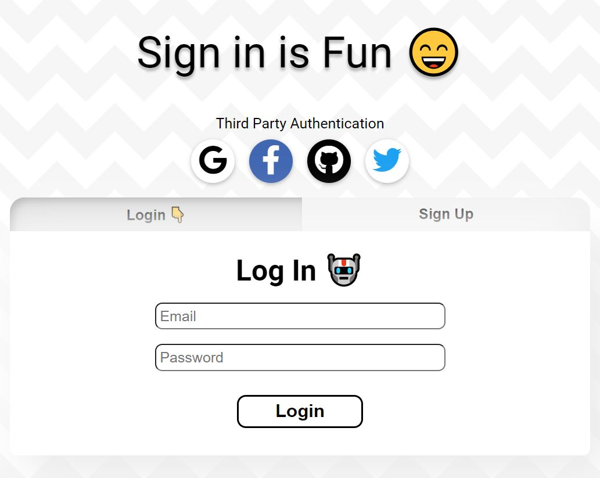
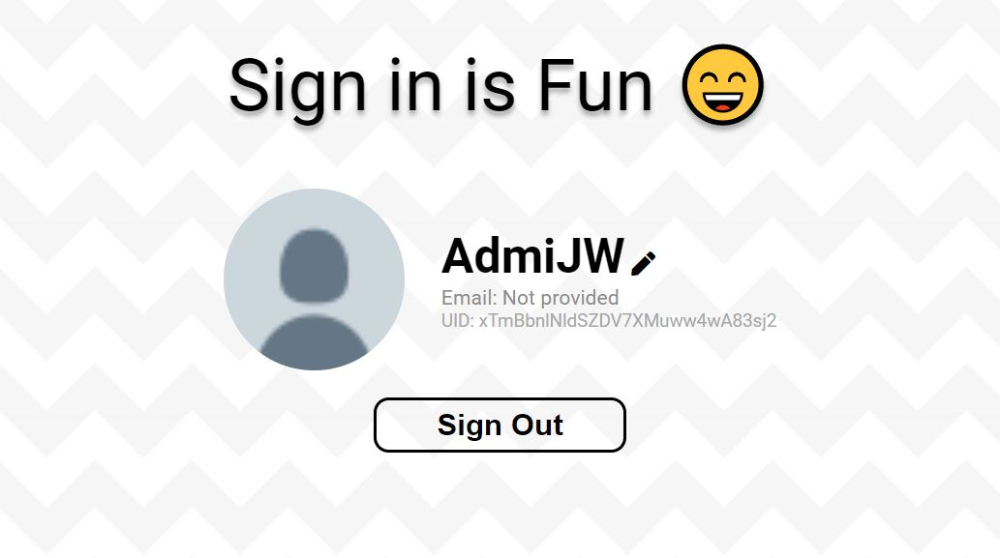

# Firebase Authentication miniproject - Sign in is Fun

A website that exists simply for the purpose of signing in and signing out.




Features:
* Allows either email+password authentication, or third party OAuth authentication using Google, Facebook, Github or Twitter.

---

## Usage

Read this if you want to host this yourself.

1. In Firebase console, initialize your project and firebase authentication if you haven't done so.
1. Enable all the authentication services:
    * Email + Password
    * Google
    * Facebook
    * Github
    * Twitter
    
    (You may need to visit the developer console for each of these third party services to obtain your own API key and API secret to use in firebase)

1. Copy your API keys and stuff from firebase console. Create a `.env` file at root directory of this project (`simple-firestore-blog`). Inside should be like this:

    ```
    REACT_APP_API_KEY=???
    REACT_APP_AUTH_DOMAIN=???
    REACT_APP_PROJECT_ID=???
    REACT_APP_STORAGE_BUCKET=???
    REACT_APP_MESSAGING_SENDER_ID=???
    REACT_APP_APP_ID=???
    REACT_APP_MEASUREMENT_ID=???
    ```

    Don't leak those information or hacker can play with your firestore (Unless you setup security rules already idk)

1. You probably are ready. Call `npm install` and `npm run start` and stuff.