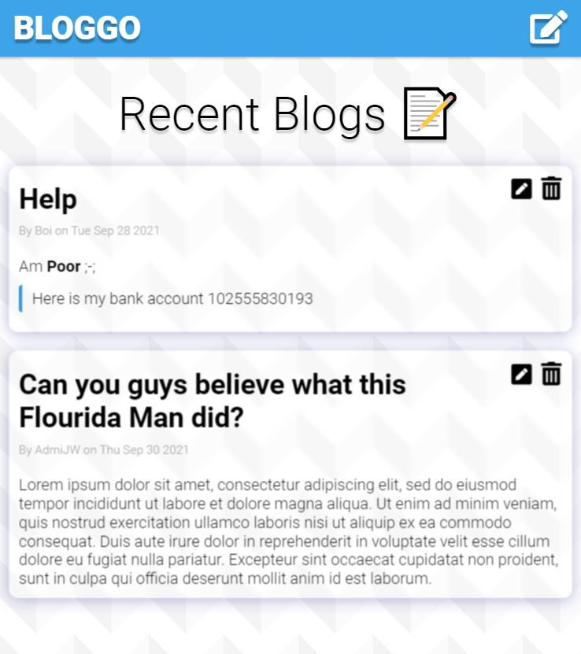
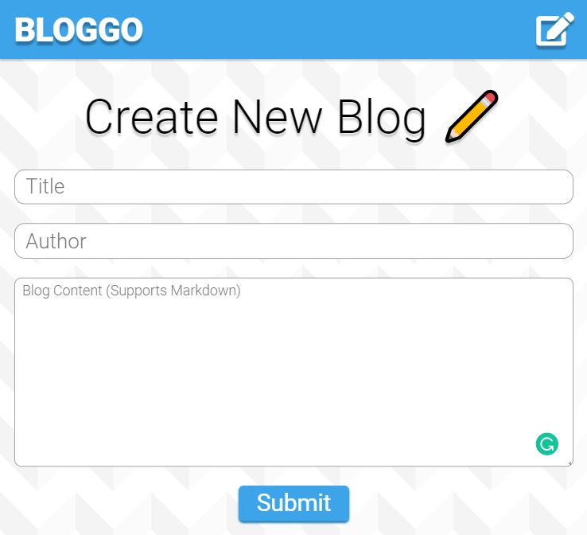

# Firestore Miniproject - Blog

A blog website using firestore to store blogs. __This project involves no security aspect and authentication__ . To prevent being hacked, I put away API keys into a `.env` file and not made publicly. See below if you want to host yourself.




Features:
* CRUD operations - Create blogs, Read blogs, Edit blogs, Delete blogs.
* Realtime update using `onSnapshot()`. Changes in firestore is reflected realtime.

---

## Usage

Read this if you want to host this yourself.

1. In Firebase console, initialize your project and firestore if you haven't done so.
1. The firestore should contain a collection `blogs`. Each blog is structured as so:

    ```js
    {
        author: string,
        content: string,
        date: firestore.serverTimestamp(),
        title: string
    }
    ```

1. Copy your API keys and stuff from firebase console. Create a `.env` file at root directory of this project (`simple-firestore-blog`). Inside should be like this:

    ```
    REACT_APP_API_KEY=???
    REACT_APP_AUTH_DOMAIN=???
    REACT_APP_PROJECT_ID=???
    REACT_APP_STORAGE_BUCKET=???
    REACT_APP_MESSAGING_SENDER_ID=???
    REACT_APP_APP_ID=???
    REACT_APP_MEASUREMENT_ID=???
    ```

    Don't leak those information or hacker can play with your firestore (Unless you setup security rules already idk)

1. You probably are ready. Call `npm install` and `npm run start` and stuff.